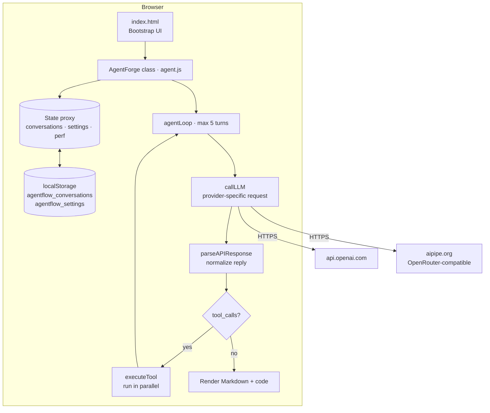
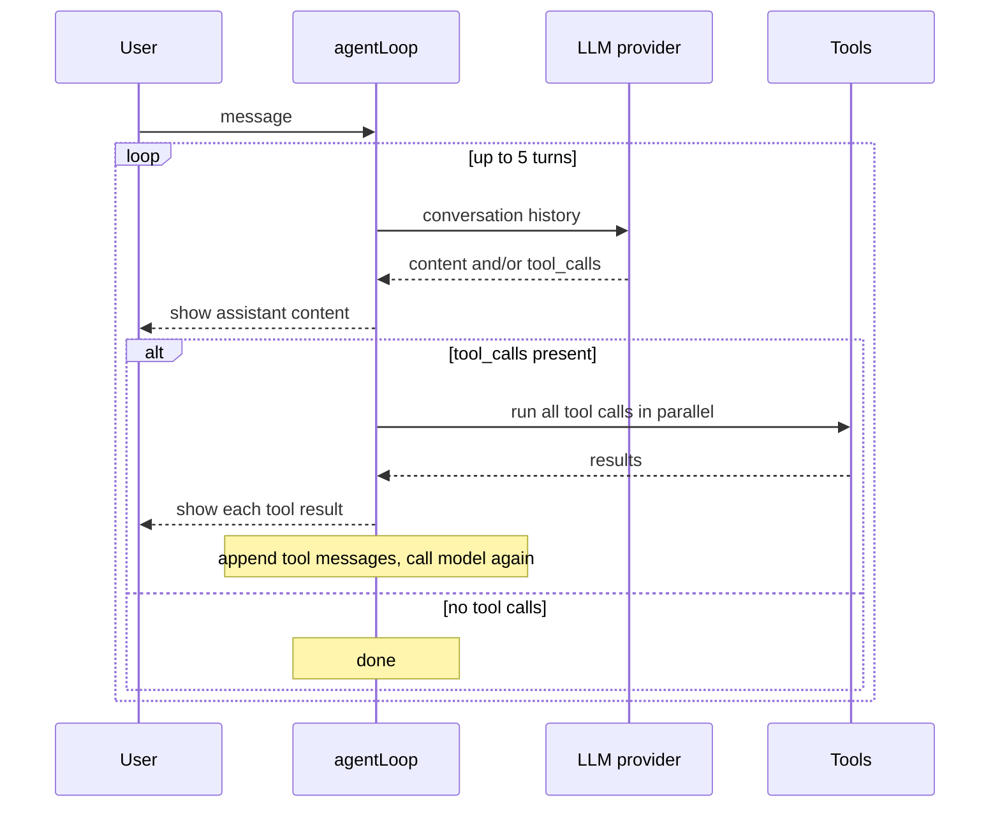

# AgentForge

A browser-only LLM chat workspace with a built-in agent loop. There's no backend: everything runs client-side, and your API key goes straight from your browser to the provider.

**Live:** [tds-llm-agent-teal.vercel.app](https://tds-llm-agent-teal.vercel.app)

> **In one line:** a single-page chat app (vanilla JS + Bootstrap) that talks to OpenAI or any OpenRouter model through AI Pipe, runs an OpenAI-style tool-calling loop, saves conversations locally, and adds voice input, Markdown rendering and a performance panel.

---

## Table of contents

1. [Why this exists](#why-this-exists)
2. [Project status](#project-status)
3. [Features](#features)
4. [Architecture](#architecture)
5. [How the agent loop works](#how-the-agent-loop-works)
6. [Providers](#providers)
7. [Tools](#tools)
8. [Project structure](#project-structure)
9. [Tech stack](#tech-stack)
10. [Getting started](#getting-started)
11. [Settings reference](#settings-reference)
12. [Design decisions](#design-decisions)
13. [Privacy and security](#privacy-and-security)
14. [Known limitations](#known-limitations)
15. [Roadmap](#roadmap)

---

## Why this exists

Agent frameworks usually mean a Python backend, a server to host and keys to manage. AgentForge explores the opposite: **how much of an LLM agent can run entirely in the browser?** No server means nothing to deploy beyond static files, no shared key to protect, and a codebase small enough to read in one sitting.

The core idea is the standard agent loop:

```python
def loop(llm):
    msgs = [user_input()]
    while True:
        output, tool_calls = llm(msgs, tools)
        print("Agent:", output)
        if tool_calls:
            msgs += [handle_tool_call(tc) for tc in tool_calls]
        else:
            msgs.append(user_input())
```

re-implemented in browser JavaScript with a production-style UI around it.

---

## Project status

| Area | Status |
| --- | --- |
| Chat UI, conversations, settings, rendering | ✅ Working |
| OpenAI and AI Pipe (OpenRouter) providers | ✅ Working |
| Agent loop (handles `tool_calls`, re-calls model, 5-turn cap) | ✅ Implemented |
| Tool schemas (`web_search`, `execute_code`, `process_file`, `create_visualization`) | ✅ Defined |
| Sending tool schemas with each request | ⏳ Not yet wired up |
| Real tool implementations | ⏳ Currently return **simulated** results |
| Gemini request format, Anthropic provider | ⏳ Planned |

The loop and tool plumbing are in place; connecting the tools end to end is the next milestone (see [Roadmap](#roadmap)).

---

## Features

**Chat and conversations**
- Multiple conversations, each with its own history, saved to `localStorage` and restored on reload (the most recent one opens automatically).
- **Export** any conversation as a Markdown file.
- Per-message actions: **copy** to clipboard, or **edit** (loads the text back into the input box).
- **Enter** to send, **Shift+Enter** for a new line.

**Rendering**
- Assistant replies rendered as **Markdown** (`marked`), with **syntax-highlighted code blocks** (`highlight.js`, language auto-detected).
- Separate visual styles for user, assistant, system and tool messages.

**Models**
- Switch provider and model from the settings panel.
- **Live model lists** fetched from the provider's `/models` endpoint (AI Pipe checks both its OpenRouter and OpenAI routes).
- Adjustable **temperature** and **max tokens**.

**Voice**
- **Voice input** through the Web Speech API (`SpeechRecognition`), where the browser supports it.
- Settings for voice output, language and speech rate.

**Files**
- File picker with a supported-types check; uploads are acknowledged in the chat as metadata (see [Known limitations](#known-limitations)).

**Diagnostics**
- **Performance panel:** response time (via `PerformanceObserver`), number of API calls, and JS heap usage (Chromium browsers).
- Every tool call and its result appear in the chat, which makes the agent's steps easy to follow.

**UI**
- Light, dark and auto **themes**; adjustable font size; animation toggle.
- Toast notifications for every success and error, a loading screen, and a collapsible sidebar.
- **Demo mode:** without an API key, the app replies with a placeholder so the UI can be explored safely.

---

## Architecture



All application logic is in one class, `AgentForge`:

- **State** is wrapped in a JavaScript `Proxy`, so every change triggers `onStateChange` and the UI stays in sync without a framework.
- An **`EventTarget` event bus** decouples UI events from agent logic.
- Conversations are held in a `Map` and serialized to `localStorage` on change.

---

## How the agent loop works



1. The user's message is appended to the conversation.
2. `callLLM` sends the history to the selected provider, and `parseAPIResponse` normalizes the reply into `{ content, tool_calls }`.
3. Any `content` is shown immediately.
4. If `tool_calls` are present, the assistant's tool request is recorded, every call runs in parallel with `Promise.all`, and each result is appended as a `tool` message tied to its `tool_call_id`. The loop then calls the model again so it can use the results.
5. The loop ends when the model replies without tool calls, when an error occurs (shown as a system message), or after **5 turns**.

---

## Providers

| Provider | Endpoint | Auth | Notes |
| --- | --- | --- | --- |
| **OpenAI** | `https://api.openai.com/v1/chat/completions` | `Bearer` key | Model list from `/v1/models` |
| **AI Pipe** | `https://aipipe.org/openrouter/v1/chat/completions` | `Bearer` token | Any OpenRouter model (default `openai/gpt-4o-mini`); model list from AI Pipe's OpenRouter and OpenAI routes |

Messages are stored in OpenAI chat format and translated per provider inside `callLLM`, so adding a provider means writing one request builder and one response parser.

When a request fails, the provider's error message is extracted from the response body and shown in the chat, along with a hint to check the selected model.

---

## Tools

Tools are declared with OpenAI function-calling JSON schemas:

| Tool | Parameters | Intended behaviour | Current state |
| --- | --- | --- | --- |
| `web_search` | `query` (string), `results` (int, default 5) | Search the web for current information | Simulated |
| `execute_code` | `code` (string) | Run JavaScript and return the output | Simulated |
| `process_file` | `fileId` (string), `operation` (default `analyze`) | Analyse an uploaded file | Simulated |
| `create_visualization` | `data` (string), `type` (default `line`), `title` | Produce a chart from data | Simulated |

Each tool is dispatched by name in `executeTool`, and unknown tool names return a structured error instead of throwing.

---

## Project structure

```text
agentforge/
├── index.html    # Layout: sidebar, chat, settings modal, performance panel, loading screen
├── agent.js      # AgentForge class: state, UI, agent loop, providers, tools, storage, voice
├── styles.css    # Theme variables, light/dark styles, message styles, animations
├── LICENSE       # MIT
└── README.md
```

---

## Tech stack

| Concern | Technology |
| --- | --- |
| Language | Vanilla **JavaScript** (ES2020+, classes, async/await, Proxy) |
| UI | **Bootstrap 5.3**, custom CSS with theme variables |
| Markdown | **marked** |
| Code highlighting | **highlight.js** |
| Voice | **Web Speech API** |
| Persistence | **localStorage** |
| Hosting | **Vercel** (static) |

No build step, no bundler, no framework.

---

## Getting started

### Run locally

```bash
git clone https://github.com/Riddhim-r/agentforge.git
cd agentforge

# Option 1: open index.html directly in Chrome, Edge or Firefox
# Option 2: serve the folder (recommended, avoids file:// restrictions)
python -m http.server 8000
```

Then open **http://localhost:8000**.

### Connect a model

1. Open **Settings** (gear icon).
2. Choose a **provider**: OpenAI or AI Pipe.
3. Paste your **API key** or AI Pipe token.
4. Pick a **model** from the list, which is loaded live from the provider.
5. Save, then start chatting.

### Deploy

Any static host works (Vercel, Netlify, GitHub Pages). Upload the three files; nothing needs configuring.

---

## Settings reference

| Group | Setting | Default |
| --- | --- | --- |
| LLM | Provider | `aipipe` |
| LLM | Model | provider default |
| LLM | Max tokens | `2000` |
| LLM | Temperature | `0.7` |
| UI | Theme | `auto` |
| UI | Font size | `medium` |
| UI | Animations | on |
| UI | Sounds | off |
| Voice | Input, output, language, speech rate | configurable |
| Advanced | Auto-save, max history | configurable |

All settings are saved in `localStorage` under `agentflow_settings`.

---

## Design decisions

**1. Client-side only.**
Requests go directly from the browser to the provider. There's no server to host, scale or secure, and no shared key that could leak or be abused. Hosting costs nothing.

**2. One internal message format.**
Conversations are kept in OpenAI chat format, the de facto standard, and translated per provider only at the edge. The rest of the app never needs to know which model is answering.

**3. A bounded agent loop.**
The loop is capped at 5 model calls per user message, so a model that keeps requesting tools can't burn through someone's API credits.

**4. Parallel tool execution.**
Independent tool calls from one model turn run together with `Promise.all`, which cuts latency when the model asks for several things at once.

**5. Make every step visible.**
Tool requests and results are shown as messages, and API calls and timings are tracked in the performance panel, so you can see exactly what the agent did and why.

**6. Reactive state without a framework.**
A `Proxy` around the state object turns every assignment into a change notification, which gives framework-like reactivity in plain JavaScript.

---

## Privacy and security

- Conversations and settings stay in **your browser's `localStorage`**. Nothing is sent anywhere except the model requests themselves.
- **Your API key is also saved in `localStorage`** so you don't have to re-enter it. On a shared computer, clear this site's data in your browser when you're done.
- Model output is rendered as Markdown, so it should be treated as untrusted HTML; adding an HTML sanitizer such as DOMPurify is on the roadmap.

---

## Known limitations

- Tool schemas are defined but **not yet sent** with the model request, so models currently answer without calling tools.
- Tool implementations return **simulated** results.
- `tool` messages are converted to `system` messages before sending, which works but loses the strict `tool_call_id` link that OpenAI expects.
- The Gemini request body doesn't yet match Google's `contents`/`parts` format, and Anthropic models are listed but have no request builder.
- Uploaded files are acknowledged by name and size but not read or stored.

---

## Roadmap

- [ ] Send the `tools` array with every request, and keep `tool` messages in native OpenAI format.
- [ ] `execute_code`: run JavaScript in a sandboxed **Web Worker** with a timeout and captured console output.
- [ ] `web_search`: real results through a search API.
- [ ] `process_file`: read uploads with `FileReader` (text, CSV, JSON) and pass content to the model.
- [ ] `create_visualization`: render charts with Chart.js.
- [ ] Add an Anthropic request builder and fix the Gemini format.
- [ ] Sanitize rendered Markdown with DOMPurify.
- [ ] Stream tokens as they arrive.

---

## License

MIT, see [LICENSE](LICENSE).

## Author

**Riddhim Rathor** · [LinkedIn](https://linkedin.com/in/riddhim-rathor) · [Portfolio](https://riddhim-spotted-on.vercel.app/) · [GitHub](https://github.com/Riddhim-r)
